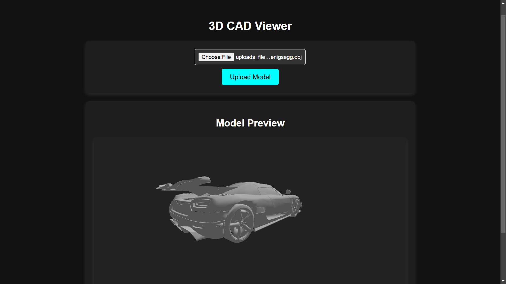
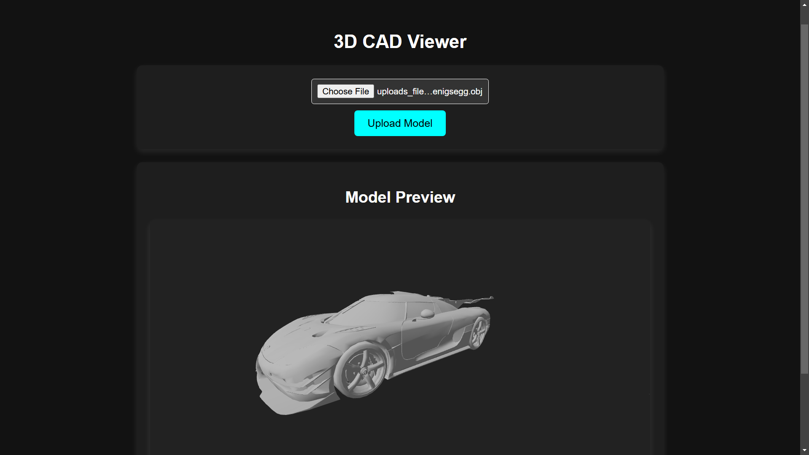
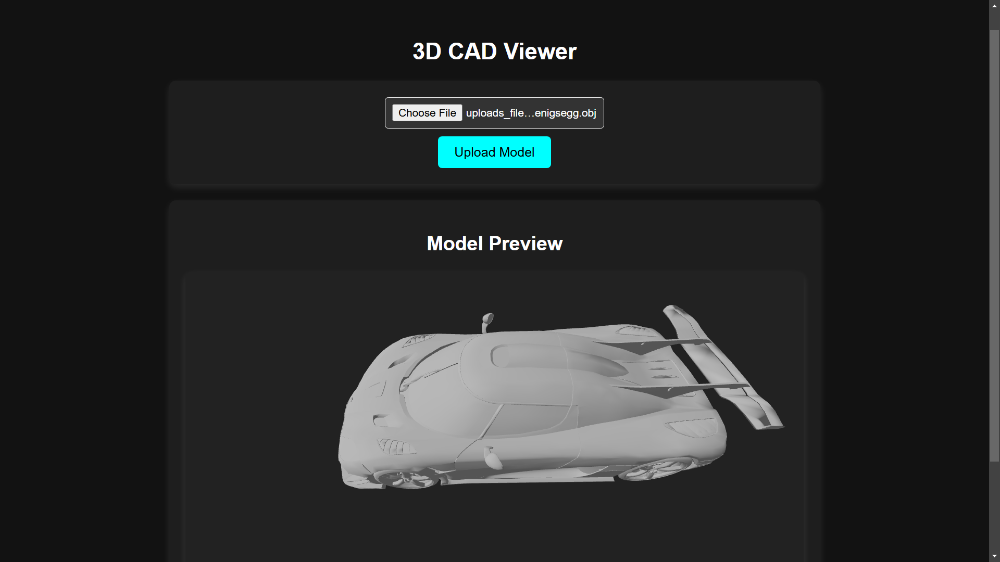

# Web-Based CAD Viewer

A simple web-based CAD viewer that allows users to upload, view, and manipulate 3D models (STL/OBJ files) using Three.js for rendering. The project consists of a React frontend and a Flask backend.

## Features
- Upload and view .OBJ 3D models.
- Rotate, zoom, and pan the model with UI controls.
- Backend API for handling file uploads and model retrieval.


## Tech Stack
- **Frontend:** React, Three.js
- **Backend:** Flask
- **Others:** Node.js, Python

## Installation & Setup

### Prerequisites
Ensure you have the following installed:
- **Node.js & npm** (for frontend)
- **Python** (for backend)

### Backend Setup
1. Navigate to the backend folder:
   ```sh
   cd backend
   ```
2. Create a virtual environment (optional but recommended):
   ```sh
   python -m venv venv
   source venv/bin/activate  # On Windows, use 'venv\Scripts\activate'
   ```
3. Install dependencies:
   ```sh
   pip install -r requirements.tx
   ```
4. Start the Flask server:
   ```sh
   python app.py
   ```

### Frontend Setup
1. Navigate to the frontend folder:
   ```sh
   cd frontend
   ```
2. Install dependencies:
   ```sh
   npm install
   ```
3. Start the React development server:
   ```sh
   npm start
   ```

## Usage
1. Open the frontend in a browser (`http://localhost:3000`).
2. Upload a 3D model (OBJ).
3. Use the controls to rotate, zoom, and pan the model
## Screenshots





